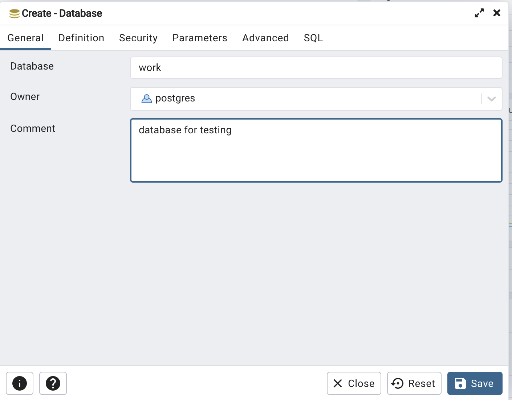
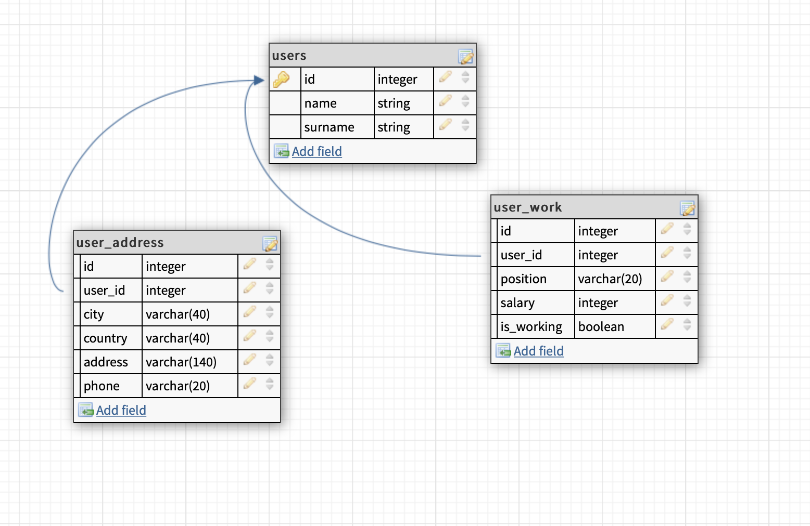

Все примеры будут показаны на PostgreSQL, который можно установить по ссылке https://www.postgresql.org/download/


После этого создадим таблицу work


Теперь нам необходимо создать таблицы для нашей базы. Мы будем работать с базой, которая хранит информацию об офисных работниках: Имя, Фамилию, адрес, зарплату и так далее. Таблицы будут выглядит примерно так


С помощью Query Tool (https://www.pgadmin.org/docs/pgadmin4/6.9/query_tool.html) и синтаксиса SQL создадим таблицы 

Сначала таблицу пользователя (users)
```SQL
CREATE TABLE users
(
	id integer PRIMARY KEY,
	name varchar(20) NOT NULL,
	surname varchar(30)
);
```

А далее информацию о работнике и его личные данные 

```SQL
CREATE TABLE user_address
(
    id integer NOT NULL,
    user_id integer NOT NULL,
    country varchar(20),
    city varchar(20),
    address varchar(140),
    phone varchar(20),
    PRIMARY KEY (id),
	FOREIGN KEY (user_id)  REFERENCES users (id)
);
```
```SQL
CREATE TABLE user_work
(
    id_work integer NOT NULL,
    user_id integer NOT NULL,
    position varchar(20),
    salary integer,
    is_working boolean,
    PRIMARY KEY (id_work),
	FOREIGN KEY (user_id)  REFERENCES users (id)
);
```

Теперь нам надо заполнить таблицу данными.
Для таблицы пользователей
```SQL
INSERT INTO users (id, name, surname) VALUES
(1,'Alexander', 'Ivanov'),
(2,'Maxim', 'Petrov'),
(3, 'Maria', 'Lukashina'),
(4, 'Igor', 'Semenov'),
(5, 'Sveta', 'Ivanova'),
(6, 'Aidar', 'Mahmutov');
```
Для таблицы address 
```SQL
INSERT INTO user_address (id, user_id, country, city, address, phone) VALUES
(1, 1, 'Russia', 'Kazan', 'Zorge street 140-7', '894123455455'),
(2, 2, 'USA', 'NY', '20 Cooper Square', '123233455'),
(3, 3, 'Russia', 'Moscow', 'Godovikova street 100-217', '8944567880'),
(4, 4, 'Russia', 'Kazan', 'Fuchika street 18-100', '87000084566'),
(5, 5, NULL, NULL, NULL, NULL),
(6, 6, 'Polish', 'Krakov', 'Big street 1-7', NULL);
```

Для таблицы users_work
```SQL
INSERT INTO user_work (id_work, user_id, position, salary, is_working) VALUES
(1, 1, 'QA Lead', 220000, TRUE),
(2, 2, 'C++ developer', 380000, TRUE),
(3, 3, 'QA manual', 80000, FALSE),
(4, 4, 'Tech writer', 110000, TRUE),
(5, 5, 'JS developer', 238000, TRUE),
(6, 6, 'Project owner', 500000, TRUE);
```
